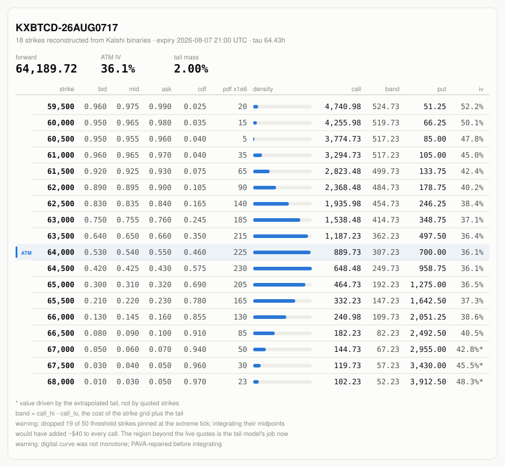
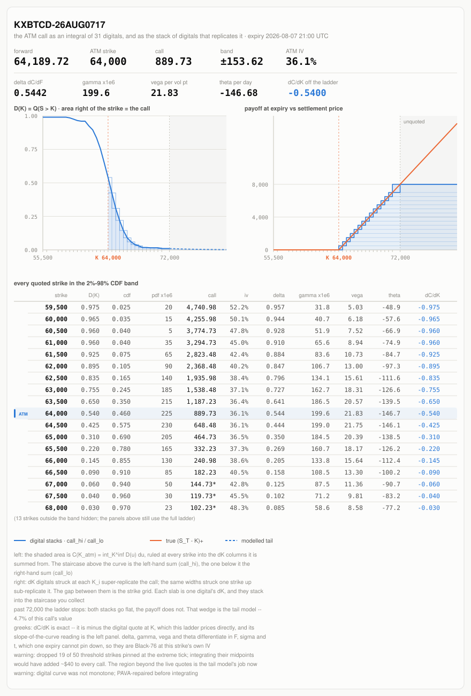
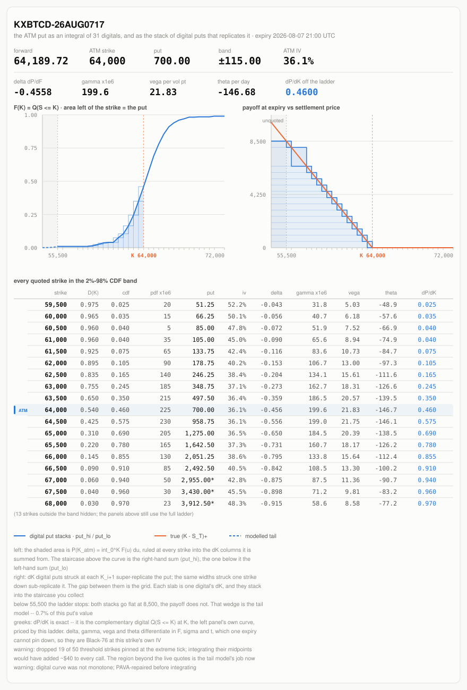

# Synthetic Crypto Options Using Kalshi

*Vanilla calls, puts, implied vols and greeks, built only from Kalshi's
"will BTC be above \$K?" contracts. No options exchange involved.*

Kalshi lists a ladder of \$1 contracts, one per strike $K$, that pay if the coin
settles above $K$. Call the price of each one $D(K)$. Then:

```math
\boxed{\;C(K) \;=\; \int_K^{\infty} D(u)\,du\;}
```

A call is the area under the ladder to the right of its strike. Everything below
is the proof of that line and what it takes to make it hold on real quotes.



**Contents:**
[Notation](#1-notation) ·
[D(K) from quotes](#2-building-dk-from-kalshi-quotes) ·
[C, P, F from D](#3-calls-puts-and-the-forward-from-dk) ·
[Riemann sum](#4-the-ladder-is-a-riemann-sum) ·
[Tails](#5-tails) ·
[Puts](#6-puts) ·
[Vols and greeks](#7-density-implied-vol-greeks) ·
[Bid/ask](#8-what-you-can-actually-trade) ·
[Setup](#setup) ·
[Use](#use) ·
[Pitfalls](#pitfalls-on-real-kalshi-data) ·
[Validation](#validation)

---

## 1. Notation

| symbol | meaning |
|---|---|
| $S_T$ | the contract's settlement value at expiry (a reference index fixing, per the series rules) |
| $\mathbb{Q}$ | the probabilities the market prices at (risk-neutral) |
| $D(K)$ | $\mathbb{Q}(S_T \gt K)$, the price of the "above $K$" contract |
| $f(K)$ | the density of $S_T$, so $f = -D'$ |
| $K_0 \lt K_1 \lt \dots \lt K_{n-1}$ | the quoted strikes, with $D_i = D(K_i)$ and $\Delta K_i = K_{i+1} - K_i$ |
| $C(K)$, $P(K)$, $F$ | call, put and forward: $\mathbb{E}[(S_T-K)^+]$, $\mathbb{E}[(K-S_T)^+]$, $\mathbb{E}[S_T]$ |
| $\tau$, $\mathrm{DF}$ | years to expiry, and the discount factor $e^{-r\tau}$ (default $r = 0$, so $\mathrm{DF} = 1$) |

## 2. Building D(K) from Kalshi quotes

**Why a price is a probability.** A contract paying $\mathbf{1}$ when $S_T \gt K$ costs

```math
\mathrm{DF}\cdot\mathbb{E}^{\mathbb{Q}}\big[\mathbf{1}\{S_T > K\}\big] \;=\; \mathrm{DF}\cdot\mathbb{Q}(S_T > K) \;\approx\; D(K)
```

because $\tau$ is hours to days and $1 - \mathrm{DF}$ is far inside the 1¢ tick. The
code reads each quote as $D(K)$ and discounts only the finished option (§6).

Each strike goes through five steps, in order.

**Step 1: merge the YES and NO books.** A NO ask at $x$ is a YES bid at $1 - x$:

```math
b = \max\big(b^{\text{yes}},\; 1 - a^{\text{no}}\big) \qquad a = \min\big(a^{\text{yes}},\; 1 - b^{\text{no}}\big)
```

If the book is one-sided or crossed, fall back on the last trade, and drop the
strike if there is none. If $a - b \gt 0.90$, do the same, because a 0 / 1 book
has a meaningless 0.50 mid.

**Step 2: orient every contract as "above $K$".**

```math
\text{"above } K\text{"}:\ (b_D,\ a_D) = (b,\ a) \qquad\qquad \text{"below } K\text{"}:\ (b_D,\ a_D) = (1 - a,\ 1 - b)
```

**Step 3: take the midpoint,** $m = \tfrac12 (b_D + a_D)$.

**Step 4: drop dead strikes**, i.e. books resting on the extreme tick:

```math
(b_D,\ a_D) = (0,\ 0.01) \quad\text{or}\quad (0.99,\ 1) \;\;\Rightarrow\;\; \text{drop}
```

Their mids, 0.005 and 0.995, are artefacts of the 1¢ grid. $D$ gets
*integrated*, so a dead upper wing spanning width $W$ adds
$0.005 \cdot W$ to every call. A 9,500-wide wing adds \$47.50. The dead lower wing
does the same to every put. The tail model (§5) covers the region instead.

**Step 5: force $D$ non-increasing.** A density must be $\ge 0$, so $D$ must fall with $K$.
Crossed or stale quotes break this, so the mids are projected with
pool-adjacent-violators:

```math
(D_0, \dots, D_{n-1}) \;=\; \underset{x_0 \,\ge\, x_1 \,\ge\, \cdots \,\ge\, x_{n-1}}{\arg\min}\ \sum_i \big(x_i - m_i\big)^2
```

The result is the curve every later step integrates.
Range contracts (pay if $S_T$ lands in a bin) can also be turned into $D$; see
[Pitfalls](#pitfalls-on-real-kalshi-data) for why the menu leaves them out.

## 3. Calls, puts and the forward from D(K)

**Lemma.** For $s \ge 0$, $K \ge 0$:

```math
(s-K)^+ = \int_K^{\infty} \mathbf{1}\{s > u\}\,du
\qquad
(K-s)^+ = \int_0^{K} \mathbf{1}\{s \le u\}\,du
\qquad
s = \int_0^{\infty} \mathbf{1}\{s > u\}\,du
```

*Proof.*

```math
\int_K^{\infty} \mathbf{1}\{s > u\}\,du =
\begin{cases} \int_K^{s} du = s-K, & s > K \\ 0, & s \le K \end{cases}
\;=\; (s-K)^+
\qquad\quad
\int_0^{K} \mathbf{1}\{s \le u\}\,du =
\begin{cases} \int_s^{K} du = K-s, & s \le K \\ 0, & s > K \end{cases}
\;=\; (K-s)^+
```

The third identity is the first at $K = 0$. ∎

**Theorem.** Set $s = S_T$, take $\mathbb{E}^{\mathbb{Q}}$, and swap $\mathbb{E}$ with $\int$
(Tonelli, since the integrand is $\ge 0$):

```math
\begin{aligned}
C(K) &= \mathbb{E}\big[(S_T-K)^+\big] &&= \int_K^{\infty} \mathbb{Q}(S_T > u)\,du &&= \int_K^{\infty} D(u)\,du \\[4pt]
P(K) &= \mathbb{E}\big[(K-S_T)^+\big] &&= \int_0^{K} \mathbb{Q}(S_T \le u)\,du &&= \int_0^{K} \big(1 - D(u)\big)\,du \\[4pt]
F    &= \mathbb{E}[S_T]               &&= \int_0^{\infty} \mathbb{Q}(S_T > u)\,du &&= \int_0^{\infty} D(u)\,du
\end{aligned}
```

∎

**Corollaries.** Differentiate in $K$. For parity, take $\mathbb{E}$ of $(s-K)^+ - (K-s)^+ = s - K$:

```math
\begin{aligned}
C'(K)  &= -D(K) & C''(K) &= f(K) \quad \text{(Breeden–Litzenberger)} \\[4pt]
P'(K)  &= 1 - D(K) & C(K) - P(K) &= F - K \quad \text{(put–call parity)}
\end{aligned}
```

So a vanilla call is a stack of digitals, one per \$1 of strike above $K$.
The Kalshi ladder quotes the integrand.

## 4. The ladder is a Riemann sum

Kalshi quotes $D$ only at $K_0, \dots, K_{n-1}$. Since $D$ is non-increasing, on each gap

```math
D_{i+1}\,\Delta K_i \;\le\; \int_{K_i}^{K_{i+1}} D(u)\,du \;\le\; D_i\,\Delta K_i
```

Sum from $j$ to $n-2$, and add the tail above the top strike,
$T = \int_{K_{n-1}}^{\infty} D(u)\ du = C(K_{n-1}) \ge 0$:

```math
\underbrace{\sum_{i=j}^{n-2} D_{i+1}\,\Delta K_i}_{C_{\text{lo}}(K_j)}
\;\;\le\;\; C(K_j) \;\;\le\;\;
\underbrace{\sum_{i=j}^{n-2} D_i\,\Delta K_i \;+\; T}_{C_{\text{hi}}(K_j)}
```

- $C_{\text{lo}}$ drops $T \ge 0$, so it is a **rigorous lower bound**. It assumes nothing about unquoted strikes.
- $C_{\text{hi}}$ needs $T$, which has to be modelled (§5), so it is an **estimate**, not a bound.

**Point estimate:** the trapezoid rule,

```math
C^{\ast}(K_j) \;=\; \sum_{i=j}^{n-2} \tfrac12\big(D_i + D_{i+1}\big)\,\Delta K_i \;+\; T
\;=\; \tfrac12\big(C_{\text{lo}} + C_{\text{hi}}\big) + \tfrac12 T
```

$C^{\ast}$ sits $T/2$ above the midpoint of $[C_{\text{lo}}, C_{\text{hi}}]$, so the
`band` column $C_{\text{hi}} - C_{\text{lo}}$ is a range, never "± around the call".

**The same bounds as portfolios.** The *high stack* holds $\Delta K_i$ contracts "above $K_i$";
the *low stack* holds $\Delta K_i$ contracts "above $K_{i+1}$" ($i = j, \dots, n-2$).
If $S_T \in (K_m, K_{m+1}]$ with $j \le m \le n-2$:

```math
\text{low stack} = \sum_{i=j}^{m-1} \Delta K_i = K_m - K_j
\;\;\le\;\; (S_T - K_j)^+ \;\;\le\;\;
K_{m+1} - K_j = \sum_{i=j}^{m} \Delta K_i = \text{high stack}
```

If $S_T \le K_j$, all three are 0. If $S_T \gt K_{n-1}$, both stacks stop at
$K_{n-1} - K_j$. The shortfall is $(S_T - K_{n-1})^+$, a call at the top strike, whose
price is $T$. Priced at $D$, the stacks cost exactly $C_{\text{lo}}$ and $C_{\text{hi}} - T$.



## 5. Tails

**Above the top strike:** exponential decay,

```math
D(u) = D_{n-1}\, e^{-(u - K_{n-1})/\lambda}\quad (u > K_{n-1})
\qquad\Longrightarrow\qquad
T = \int_{K_{n-1}}^{\infty} D(u)\,du = D_{n-1}\,\lambda
```

$\lambda$ comes from a least-squares fit $\ln D_i \approx a + b K_i$ over the top strikes, with $\lambda = -1/b$.
The window starts at 4 strikes and widens, up to 16, until $D$ has at least halved
across it; on 1¢ quotes a short window can be exactly flat, which gives $b = 0$.
Fallback: $T = D_{n-1} \Delta K_{n-2}$.

**Below the bottom strike:** the CDF $1 - D$ decays exponentially through $(K_0, 1-D_0)$ and $(K_1, 1-D_1)$,

```math
1 - D(u) = (1 - D_0)\, e^{-(K_0 - u)/\lambda_L},
\qquad
\lambda_L = \frac{\Delta K_0}{\ln\!\big[(1-D_1)/(1-D_0)\big]}
```

```math
L \;=\; \int_0^{K_0} D(u)\,du \;=\; K_0 - \int_0^{K_0} \big(1 - D(u)\big)\,du \;\approx\; \max\!\big(K_0 - (1 - D_0)\,\lambda_L,\ 0\big)
```

**Forward:**

```math
F \;=\; \int_0^{\infty} D(u)\,du \;=\; L + C^{\ast}(K_0)
```

`tail_weight` $= T / C^{\ast}(K_j)$. A row is flagged `model_dependent` when it exceeds 25%.

## 6. Puts

The put comes from parity, on the same curve:

```math
P(K_j) = C^{\ast}(K_j) - (F - K_j)
```

This adds no assumption. Substituting $F = L + C^{\ast}(K_0)$ and
$K_j = K_0 + \sum_{i \lt j} \Delta K_i$ gives the put's own trapezoid sum over the CDF:

```math
\begin{aligned}
P(K_j) &= K_j - L - \big(C^{\ast}(K_0) - C^{\ast}(K_j)\big) \\[2pt]
       &= K_0 + \sum_{i=0}^{j-1} \Delta K_i \;-\; L \;-\; \sum_{i=0}^{j-1} \tfrac12\big(D_i + D_{i+1}\big)\Delta K_i \\[2pt]
       &= \underbrace{(K_0 - L)}_{P(K_0)} \;+\; \sum_{i=0}^{j-1} \tfrac12\big[(1-D_i) + (1-D_{i+1})\big]\Delta K_i
\end{aligned}
```

So $P \ge 0$ and $P$ rises with $K$: $D \le 1 \Rightarrow L \le K_0$, and every term in the sum is $\ge 0$.
The mirror bounds, drawn in the put figure, use the left sum of $1 - D$ as `put_lo` and the right sum plus $K_0 - L$ as `put_hi`.

**Discounting** is applied last:

```math
C(K) = \mathrm{DF}\cdot C^{\ast}(K)
\qquad
P(K) = C(K) - \mathrm{DF}\cdot(F - K)
\qquad
\mathrm{DF} = e^{-r\tau}
```

A non-zero `rate=` treats the quotes as forward-settled. To model a price as
$\mathrm{DF} \cdot \mathbb{Q}$ instead, pass `Digital`s with the quotes divided by $\mathrm{DF}$.



## 7. Density, implied vol, greeks

**Density**, by central difference (one-sided at the ends):

```math
f(K_i) \;=\; \frac{D_{i-1} - D_{i+1}}{K_{i+1} - K_{i-1}} \;\ge\; 0
```

**Implied vol**: the $\sigma$ that solves Black-76, found by bisection. $\tau$ comes from the market's `close_time`.

```math
C(K) = \mathrm{DF}\,\big[F\,N(d_1) - K\,N(d_2)\big],
\qquad
d_{1,2} = \frac{\ln(F/K) \pm \tfrac12 \sigma^2 \tau}{\sigma\sqrt{\tau}}
```

**Greeks** come in two tiers. The strike derivatives are exact, straight off the quotes (§3):

```math
\frac{\partial C}{\partial K} = -\mathrm{DF}\cdot D(K)
\qquad
\frac{\partial P}{\partial K} = \mathrm{DF}\cdot\big(1 - D(K)\big)
\qquad
\frac{\partial^2 C}{\partial K^2} = \mathrm{DF}\cdot f(K)
```

Delta, gamma, vega and theta differentiate in $F$, $\sigma$ and $t$, which one
expiry's ladder does not pin down. They are Black-76 at each strike's own IV:

| greek | call | units shown |
|---|---|---|
| delta $\partial V/\partial F$ | $\mathrm{DF} \cdot N(d_1)$; put: $\mathrm{DF} \cdot \big(N(d_1) - 1\big)$ | per \$1 of $F$ |
| gamma $\partial^2 V/\partial F^2$ | $\mathrm{DF} \cdot \varphi(d_1) / (F\sigma\sqrt{\tau})$ | per \$1², × 1e6 |
| vega $\partial V/\partial \sigma$ | $\mathrm{DF} \cdot F \varphi(d_1) \sqrt{\tau}$ | per vol point |
| theta $-\partial V/\partial \tau$ | $rV - \mathrm{DF} \cdot F \varphi(d_1)\sigma / (2\sqrt{\tau})$ | per day |

`OptionChain.greeks(row, kind)` returns both tiers. The Black-76 four are `None`
when the vol inversion fails.

## 8. What you can actually trade

`side="bid"` / `"ask"` rebuilds the chain from that side of the book. For a call:

```math
C_{\text{lo}}\big(D^{\text{bid}}\big) \;\le\; \text{executable call} \;\le\; C_{\text{hi}}\big(D^{\text{ask}}\big)
```

That means selling the low stack at the bids, or buying the high stack at the asks plus the modelled tail.
A put integrates $1 - D$, whose bid is $1 - D^{\text{ask}}$, so the `"bid"` chain
carries call bids and **put asks**. The mid-chain `call` is a point estimate, not a fill.

---

## Setup

The library and selftest are standard-library only:

```bash
python3 -c "import riemann_chain; riemann_chain.selftest()"
```

Live quotes need a Kalshi API key:

```bash
pip install -r requirements.txt
cp config.example.ini config.ini      # fill in api_key_id
```

Save the private key (Kalshi shows it once) beside `config.ini` as
`kalshi_private_key.pem`. Both are gitignored. `use_demo = true` points at the demo
API. Only GET endpoints are called, so a read-only key is enough.

## Use

```python
from riemann_chain import build_chain

chain = build_chain(markets)          # markets = /trade-api/v2/markets dicts
print(chain.forward, chain.atm_iv())
print(chain.format_table())
```

```bash
python3 riemann_chain.py              # pick a coin, then an expiry (local time)
```

The menu lists the hourly and daily above/below ladders. It writes the chain table
plus `chain.svg`, `call.svg` and `put.svg` for the strike nearest the forward.

`build_chain` keyword arguments: `side=` (§8), `rate=` (§6), `min_strikes=`, and
`expiry=` / `now=` to price as of another moment.
`digitals_from_markets(..., drop_pinned=False)` keeps the dead strikes, for inspection.

Live output (BTC daily, 112h to expiry, excerpt of a 500-wide ladder):

```
forward    62,799.99      ATM IV 37.6% (K=63,000)

      strike    bid    mid    ask    cdf  pdf x1e6       call     band        put      iv
      59,000  0.910  0.925  0.940  0.075    40.000   3,970.00   462.50     170.00   45.4%
      61,000  0.760  0.770  0.780  0.230   120.000   2,253.75   385.00     453.75   40.6%
      63,000  0.510  0.515  0.520  0.485   170.000     970.00   257.50   1,170.00   37.6%
      65,000  0.170  0.175  0.180  0.825   115.000     322.50    87.50   2,522.50   37.7%
      67,000  0.050  0.055  0.060  0.945    25.000     127.50    27.50   4,327.50   42.4%
  band = call_hi - call_lo, a full width -- call is not centred in it
```

The smile (45% → 37% → 42%) comes out of independently quoted binaries. Nothing
in the code imposes it.

### Output fields

| field | value |
|---|---|
| `digital_bid/mid/ask` | the quote, oriented as $D(K)$ |
| `cdf`, `pdf` | $1 - D(K)$, and $f(K)$ per \$1 of strike |
| `call`, `put` | $\mathrm{DF} \cdot C^{\ast}$, and $P$ by parity (§6) |
| `call_lo`, `call_hi` | lower bound, and upper estimate (§4) |
| `band` | $C_{\text{hi}} - C_{\text{lo}}$ |
| `tail_weight` | $T / C^{\ast}$; `model_dependent` if over 25% |
| `iv` | Black-76 vol implied by `call` |

### Figures

The three SVGs are self-contained, with light and dark palettes. They come from
the `KXBTCD-26AUG0717` run (forward 64,189.72, ATM IV 36.1%) and live in `figures/`.
A re-run writes new copies to the repo root instead. Two labels have changed since
that snapshot: the band now prints as a `[lo, hi]` range rather than `±`, and the
dead-strike warning now prices calls and puts separately.

The payoff figures need two live strikes on each side of the money. Very short
expiries often have fewer, and then the figure prints the ladder's shape instead.
`OptionChain.replicable()` reports this up front.

## Pitfalls on real Kalshi data

- **Dead wings** (§2 step 4). On a 189-strike BTC ladder, keeping the 0.00 / 0.01
  strikes added $0.005 \times 9{,}500 = 47.50$ dollars to every call, and read back as a fake symmetric
  smile (the density said 26% vol, the call column 43.5%). PAVA can't see it,
  since a flat 0.005 is monotone. The forward can't see it either, because the two wings cancel in $\mathbb{E}[S]$.
- **Range (bin) ladders aren't offered in the menu.** About 190 bins, almost all
  quoted 0.00 / 0.01, so $\sum_j m_j \approx 1.95$. The code projects the bin masses onto
  $\lbrace \sum_j p_j = 1,\ b_j \le p_j \le a_j \rbrace$ and sets $D(L_i) = \sum_{j \ge i} p_j$.
  Even so, the dead bins keep slivers of mass that get integrated across ±15%:

  | same BTC daily expiry | thresholds | bins |
  |---|---|---|
  | vol from the density | 32.2% | 31.4% |
  | vol from the call column | 34.6% | **53.7%** |
  | mass beyond ±5% of forward | 0.0000% | **4.76%** |
  | implied forward | 63,831.81 | 63,555.04 |

  (The density row was measured with the older peak-based density vol, not the
  IQR one described under [Validation](#validation).) `build_chain` still accepts bin markets if you pass them in directly.
- **Use `close_time`, not `expiration_time`.** `expiration_time` is a settlement
  deadline that can be a week out. It inflates $\tau$ about 50× and guts the vols.
- **Flat tails.** A fixed 4-point tail fit can land on a flat 1¢ staircase, which
  gives a tail several times too small and lowers every call. That's why the fit window widens (§5).
- **Empty books** (0.00 / 1.00) are dropped rather than midpointed.

## Validation

`selftest()` (the last menu entry) runs offline. It prices binaries off a known
60%-vol lognormal and rebuilds them:

| check | tolerance |
|---|---|
| forward | 2e-3 |
| every call, as a fraction of $F$ | 1e-4 |
| IV over the 2–98% CDF band | 5e-3 (actual: 4e-4) |
| $C_{\text{lo}} \le$ true call | every strike |
| parity, $\int f = 1$, PAVA, degenerate ladders | ✓ |
| Black-76 greeks vs finite differences; $\partial C/\partial K$ vs the slope of the `call` column | ✓ |
| figure stacks re-priced to $C_{\text{lo}}$, $C_{\text{hi}}$ | 1e-9 |

**Across markets.** `KXBTCD` (thresholds) and `KXBTC` (bins) are separate books on the same
expiry. Rebuilt separately, their forwards agree to 0.05–0.14%; before the bin
fix they were 3.6% apart.

**Within one chain**, the same curve is read two ways, locally and globally:

```math
\sigma_{\text{IQR}} = \frac{\ln(K_{75}/K_{25})}{2\,z_{0.75}\,\sqrt{\tau}}
\quad \big(\mathbb{Q}(S_T \le K_q) = q,\ z_{0.75} = 0.6745\big)
\qquad \text{vs.} \qquad
\sigma_{\text{ATM}} \text{ from the call column}
```

`_vol_consistency` warns when $\sigma_{\text{ATM}} / \sigma_{\text{IQR}} \gt 1.25$.
For comparison, fat tails alone read 1.14× (Student-t, 4 dof), and bin smear reads 1.8×.
It cannot catch a *constant* added to every call; dropping dead strikes handles that.
A matching forward proves nothing on its own: wing errors cancel in $\mathbb{E}[S]$ and add in $\mathbb{E}[(S-K)^+]$.

## Layout

- `riemann_chain.py`: the reconstruction, the figures, the menu and `selftest()`.
  The library imports no third-party packages and touches no network.
- `kalshi_client.py`: a signed, read-only REST client (RSA-PSS). It never places orders.

## License

MIT, see [LICENSE](LICENSE). This is research code, not trading advice. `call_hi` is an estimate, not a
bound, and the numbers are only as good as the order book behind them.
